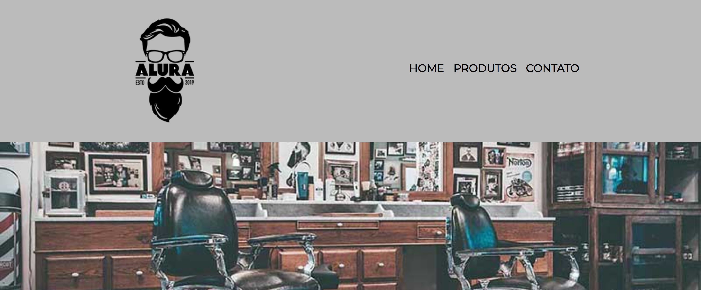

<h1 align="center" id="top"> Barbearia Alura </h1>

  Página responsiva feita com HTML e CSS para absorver o conteúdo das aulas da plataforma <a href="https://cursos.alura.com.br/">Alura</a>.

 

  <a href="#-tecnologias">Tecnologias</a>&nbsp;&nbsp;&nbsp;|&nbsp;&nbsp;&nbsp;
  <a href="#-projeto">Projeto</a>&nbsp;&nbsp;&nbsp;|&nbsp;&nbsp;&nbsp;
  <a href="#memo-licença">Licença</a>

  

 

  

 

## 🚀 Tecnologias

Esse projeto foi desenvolvido com as seguintes tecnologias:

- HTML
- CSS

## 💻 Projeto

Página responsiva feita com HTML e CSS.

- [Visite o projeto online](https://barbaraishioka.github.io/desenvolve2023/projetos/barbearia-alura/pages/index.html)

## :memo: Licença

Esse projeto está sob a licença MIT.

#

Feito com ♥ by [Bárbara Ishioka](https://www.linkedin.com/in/barbaraishioka/).

<a href="#top">⬆️ Voltar ao topo</a>

